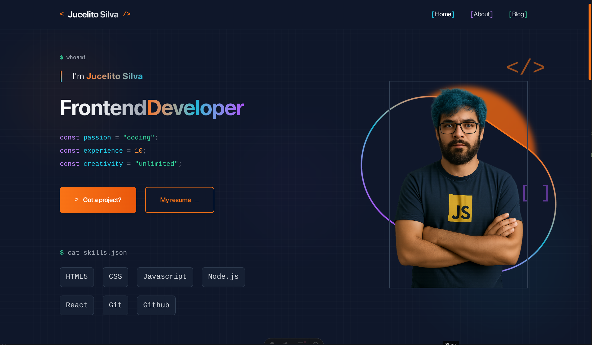

# 🚀 Jucelito Silva - Frontend Developer Theme

<div align="center">

[](#english) [](#português)



</div>

---

## Português

### 📋 Sobre o Projeto

Um tema moderno e elegante para desenvolvedores criarem seus portfólios pessoais. Desenvolvido com Astro, React e Tailwind CSS, oferece uma experiência visual impressionante com animações suaves e design responsivo.

### ✨ Características

- 🎨 **Design Moderno**: Interface limpa e profissional com tema dark
- 📱 **Totalmente Responsivo**: Funciona perfeitamente em todos os dispositivos
- ⚡ **Performance Otimizada**: Construído com Astro para máxima velocidade
- 🎭 **Animações Suaves**: Efeitos visuais elegantes e interativos
- 📝 **Blog Integrado**: Sistema de blog com suporte a MDX
- 🔧 **Fácil Customização**: Componentes modulares e bem organizados

### 🛠️ Tecnologias Utilizadas

- **[Astro](https://astro.build/)** - Framework web moderno
- **[React](https://reactjs.org/)** - Biblioteca para interfaces de usuário
- **[TypeScript](https://www.typescriptlang.org/)** - JavaScript com tipagem estática
- **[Tailwind CSS](https://tailwindcss.com/)** - Framework CSS utilitário
- **[MDX](https://mdxjs.com/)** - Markdown com componentes JSX

### 🚀 Como Usar

#### 1. Clone o Repositório

```bash
git clone https://github.com/renatokhael/astro-theme-jucelito-silva.git
cd astro-theme-jucelito-silva
```

#### 2. Instale as Dependências

```bash
npm install
```

#### 3. Execute o Projeto

```bash
npm run dev
```

O projeto estará disponível em `http://localhost:4321`

#### 4. Build para Produção

```bash
npm run build
```

### 🎨 Customização

#### Informações Pessoais

Edite o arquivo `src/consts.ts` para alterar as informações básicas:

```typescript
export const SITE_TITLE = "Seu Nome";
export const SITE_DESCRIPTION = "Sua descrição";
```

#### Cores e Estilos

Personalize as cores no arquivo `src/styles/global.css`:

```css
--color-orange-500: #f97316; /* Cor principal */
--color-slate-900: #0f172a; /* Cor de fundo */
```

#### Conteúdo

- **Sobre**: Edite `src/components/templates/AboutPage.tsx`
- **Serviços**: Modifique `src/components/organisms/ServicesSection.tsx`
- **Portfólio**: Atualize `src/components/organisms/PortfolioSection.tsx`
- **Blog**: Adicione posts em `src/content/blog/`

#### Imagens

Substitua as imagens em `public/` pelas suas próprias:

- `blog-placeholder-about.jpg` - Sua foto de perfil
- `blog-placeholder-*.jpg` - Imagens dos projetos

### 📁 Estrutura do Projeto

```
src/
├── components/
│   ├── atoms/          # Componentes básicos
│   ├── molecules/      # Componentes compostos
│   ├── organisms/      # Seções complexas
│   └── templates/      # Páginas completas
├── content/
│   └── blog/          # Posts do blog
├── layouts/           # Layouts das páginas
├── pages/             # Rotas da aplicação
└── styles/            # Estilos globais
```

### 📝 Licença

Este projeto está sob a licença MIT. Veja o arquivo [LICENSE](LICENSE) para mais detalhes.

---

## English

### 📋 About the Project

A modern and elegant theme for developers to create their personal portfolios. Built with Astro, React, and Tailwind CSS, it offers an impressive visual experience with smooth animations and responsive design.

### ✨ Features

- 🎨 **Modern Design**: Clean and professional interface with dark theme
- 📱 **Fully Responsive**: Works perfectly on all devices
- ⚡ **Optimized Performance**: Built with Astro for maximum speed
- 🎭 **Smooth Animations**: Elegant and interactive visual effects
- 📝 **Integrated Blog**: Blog system with MDX support
- 🔧 **Easy Customization**: Modular and well-organized components

### 🛠️ Technologies Used

- **[Astro](https://astro.build/)** - Modern web framework
- **[React](https://reactjs.org/)** - User interface library
- **[TypeScript](https://www.typescriptlang.org/)** - JavaScript with static typing
- **[Tailwind CSS](https://tailwindcss.com/)** - Utility-first CSS framework
- **[MDX](https://mdxjs.com/)** - Markdown with JSX components

### 🚀 How to Use

#### 1. Clone the Repository

```bash
git clone https://github.com/renatokhael/astro-theme-jucelito-silva.git
cd astro-theme-jucelito-silva
```

#### 2. Install Dependencies

```bash
npm install
```

#### 3. Run the Project

```bash
npm run dev
```

The project will be available at `http://localhost:4321`

#### 4. Build for Production

```bash
npm run build
```

### 🎨 Customization

#### Personal Information

Edit the `src/consts.ts` file to change basic information:

```typescript
export const SITE_TITLE = "Your Name";
export const SITE_DESCRIPTION = "Your description";
```

#### Colors and Styles

Customize colors in the `src/styles/global.css` file:

```css
--color-orange-500: #f97316; /* Primary color */
--color-slate-900: #0f172a; /* Background color */
```

#### Content

- **About**: Edit `src/components/templates/AboutPage.tsx`
- **Services**: Modify `src/components/organisms/ServicesSection.tsx`
- **Portfolio**: Update `src/components/organisms/PortfolioSection.tsx`
- **Blog**: Add posts in `src/content/blog/`

#### Images

Replace images in `public/` with your own:

- `blog-placeholder-about.jpg` - Your profile photo
- `blog-placeholder-*.jpg` - Project images

### 📁 Project Structure

```
src/
├── components/
│   ├── atoms/          # Basic components
│   ├── molecules/      # Compound components
│   ├── organisms/      # Complex sections
│   └── templates/      # Complete pages
├── content/
│   └── blog/          # Blog posts
├── layouts/           # Page layouts
├── pages/             # Application routes
└── styles/            # Global styles
```

### 📝 License

This project is under the MIT license. See the [LICENSE](LICENSE) file for more details.

---

<div align="center">

**Desenvolvido com ❤️ por [Renato Khael](https://renatokhael.com)**

**Developed with ❤️ by [Renato Khael](https://renatokhael.com)**

</div>
